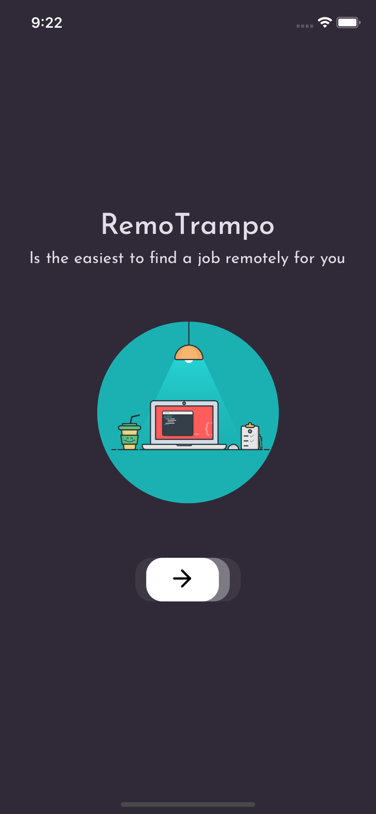
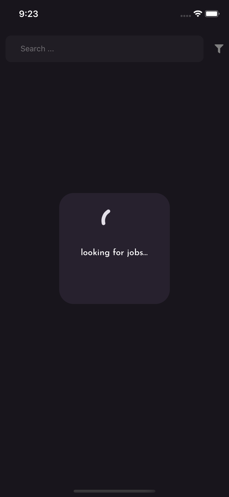
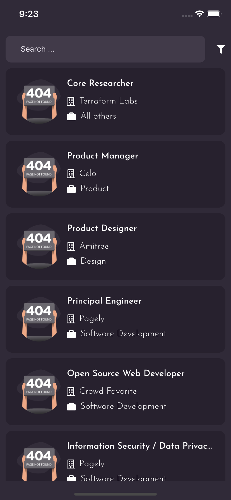
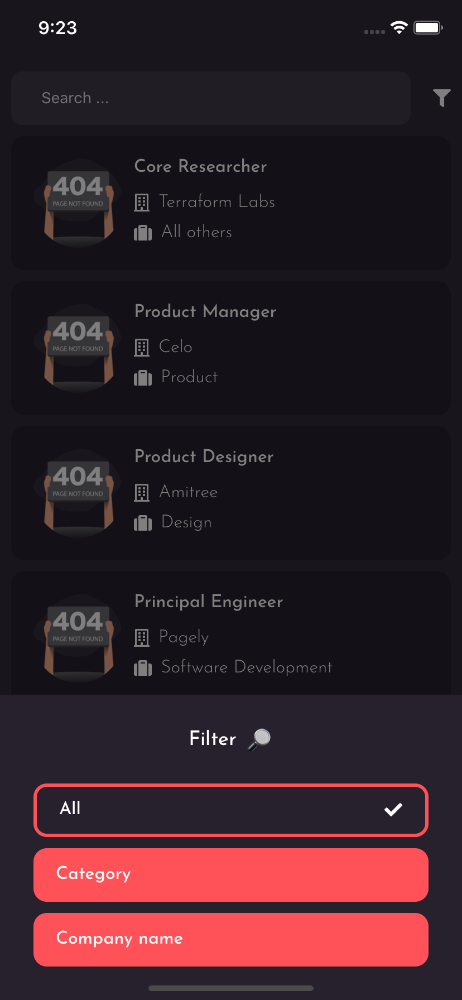
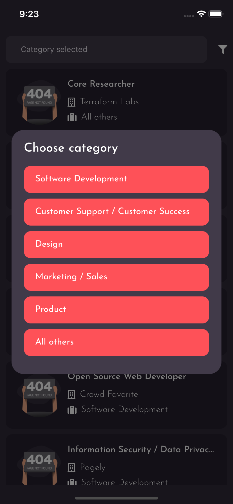

<h1 align="center">Remotrampo  </h1>

### Description
APP created to search for remote jobs, this app was created for study purposes, using Typescript and styled-components
API used in the project: https://remotive.io/api-documentation

#### 📷 Prints

  
  
  
  
  
 

---
